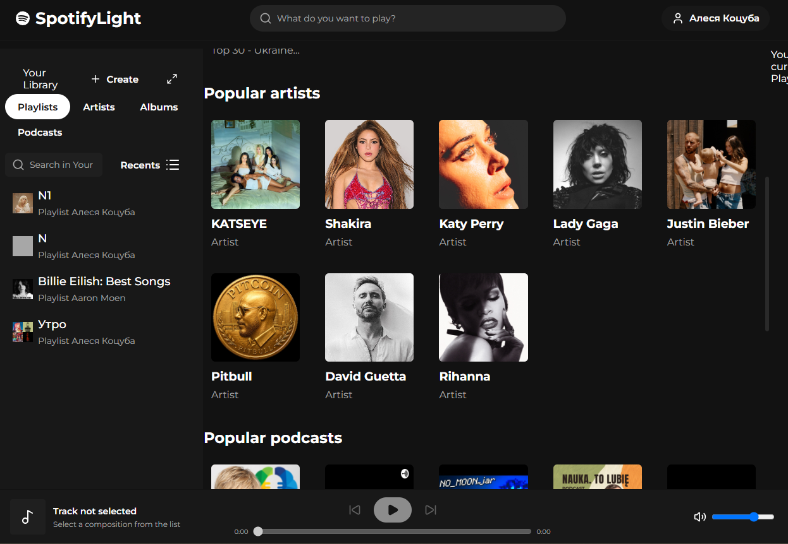

SpLight

SpLight is an educational web application built with React, TypeScript, Spotify Web API and Spotify Web Playback SDK.

The application allows users to sign in with Spotify, search for music, browse their library and control playback in the browser.

SpLight is an independent, non-commercial educational project. It is not affiliated with, sponsored by or endorsed by Spotify AB.

Features:

- Spotify authentication with PKCE;
- Automatic access-token refresh;
- Search for tracks, artists, albums, playlists and podcasts;
- View saved playlists, albums and podcasts;
- View followed artists;
- View recently played tracks;
- Create private playlists;
- Browse artist releases;
- View album tracks;
- View podcast episodes;
- Save and remove supported content from the library;
- Play Spotify content in the browser;
- Pause and resume playback;
- Switch between tracks;
- Seek through the current track;
- Control playback volume;
- Handle Spotify authorization and API errors;
- Handle rate limits and Development Mode quota errors;

Screenshots

Technology Stack

- React 19;
- TypeScript;
- React Router;
- Vite;
- CSS Modules;
- Spotify Web API;
- Spotify Web Playback SDK;
- Vitest;
- Testing Library;
- Lucide React;
- Structure

src/
├── app/ # Application configuration, routing and global styles
├── entities/ # Tracks, artists, albums and playlist entities
├── features/ # Application features and business logic
├── pages/ # Route-level components
├── shared/ # Shared UI, API utilities and helpers
├── test/ # Shared test configuration
└── widgets/ # Large interface sections

The project uses a simplified feature-oriented architecture. API requests, domain models, reusable UI and page components are separated into different layers.

Requirements

To run the project, you need:

- Node.js 20.19 or newer;
- npm;
- Spotify account;
- Spotify Premium;
- Spotify Developer application;
- modern web browser

Development Mode Limitations

Spotify Development Mode is intended for learning, experimentation and personal non-commercial projects.

Important limitations include:

- The application owner must have Spotify Premium.
- Only allowlisted users can authorize the application.
- Spotify limits the number of API requests.
- Development Mode applications share the developer account quota.
- Some API endpoints and fields may not be available.
- Spotify may return only metadata for playlists that the user does not own or collaborate on.
- Web Playback SDK requires Spotify Premium.
- Development Mode is not intended for a large-scale commercial application.

---

SpLight

SpLight — это учебное веб-приложение, разработанное с использованием React, TypeScript, Spotify Web API и Spotify Web Playback SDK.

Приложение позволяет пользователям авторизоваться через Spotify, искать музыку, просматривать свою медиатеку и управлять воспроизведением в браузере.

SpLight — независимый некоммерческий учебный проект. Он не связан со Spotify AB, не спонсируется и не поддерживается Spotify.

Возможности:

- Авторизация через Spotify с использованием PKCE;
- автоматическое обновление access token;
- поиск треков, исполнителей, альбомов, плейлистов и подкастов;
- просмотр сохранённых плейлистов, альбомов и подкастов;
- просмотр исполнителей, на которых подписан пользователь;
- просмотр недавно прослушанных треков;
- создание приватных плейлистов;
- просмотр релизов исполнителей;
- просмотр треков альбома;
- просмотр выпусков подкаста;
- добавление и удаление поддерживаемого контента из медиатеки;
- воспроизведение контента Spotify в браузере;
- приостановка и возобновление воспроизведения;
- переключение между треками;
- перемотка текущего трека;
- управление громкостью;
- обработка ошибок авторизации и Spotify API;
- обработка ограничения частоты запросов и ошибок квоты Development Mode.

Скриншоты

Стек технологий

- React 19;
- TypeScript;
- React Router;
- Vite;
- CSS Modules;
- Spotify Web API;
- Spotify Web Playback SDK;
- Testing Library;
- Lucide React.
- Структура проекта

src/
├── app/ # Конфигурация приложения, маршрутизация и глобальные стили
├── entities/ # Сущности треков, исполнителей, альбомов и плейлистов
├── features/ # Возможности приложения и бизнес-логика
├── pages/ # Компоненты отдельных страниц
├── shared/ # Общие UI-компоненты, API-функции и вспомогательные инструменты
├── test/ # Общая конфигурация тестов
└── widgets/ # Крупные части пользовательского интерфейса

В проекте используется упрощённая архитектура, ориентированная на функциональные возможности приложения. API-запросы, модели предметной области, переиспользуемые UI-компоненты и компоненты страниц разделены по разным слоям.

Требования

Для запуска проекта необходимы:

- Node.js 20.19 или новее;
- npm;
- аккаунт Spotify;
- подписка Spotify Premium;
- приложение, зарегистрированное в Spotify Developer Dashboard;
- современный веб-браузер.

Ограничения Development Mode

Spotify Development Mode предназначен для обучения, экспериментов и личных некоммерческих проектов.

Важные ограничения:

- владелец приложения должен иметь подписку Spotify Premium;
- авторизоваться в приложении могут только пользователи, добавленные в список разрешённых;
- Spotify ограничивает количество API-запросов;
- приложения в Development Mode используют общую квоту аккаунта разработчика;
- некоторые API endpoints и поля могут быть недоступны;
- Spotify может возвращать только метаданные плейлистов, которыми пользователь не владеет и в которых он не является соавтором;
- для использования Web Playback SDK необходима подписка Spotify Premium;
- Development Mode не предназначен для крупных коммерческих приложений.
